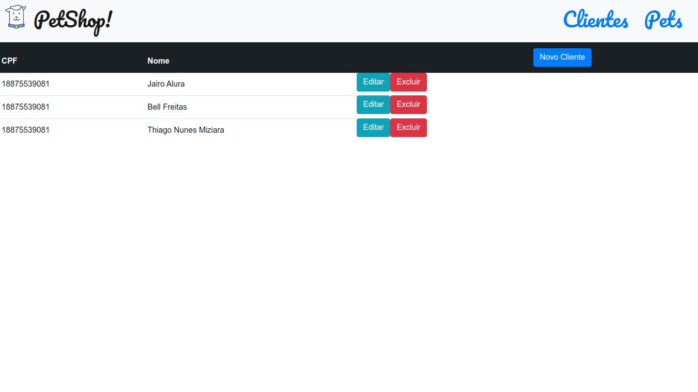

<h1>Projeto Spa com JavaScript Vanilla</h1>

Para a aplicação funcionar na sua máquina você tem que dar o comando npm run build

E depois `npm start` para rodar o servidor local.

<h3>Tecnologias</h3>

<h5>Esse projeto foi desenvolvido utilizando as seguintes tecnologias:</h5>
<ul>
<li>Node.js</li>
<li>Express</li>
<li>SQLite</li>
<li>JavaScript</li>
<li>CSS</li>
<li>Bootstrap</li>
<li>HTML</li>
</ul>

